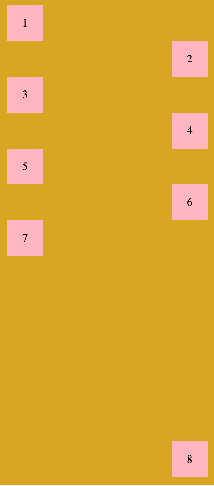

# CSS Task

Welcome in the CSS Flexbox task.

## For your information

You don't need to set widths and heights exactly the same as it is in the screenshot below, this task is about how you
can handle positioning elements with flexbox.

### If you still want to do this, these are useful information about the project:

colors: `goldenrod, lightpink`

sizes: `50px`

container-width: `300px`

padding: `10px`

## Your task

You need to create styles in external `style.css` file (you can't touch HTML). Your result should look like this:

   
