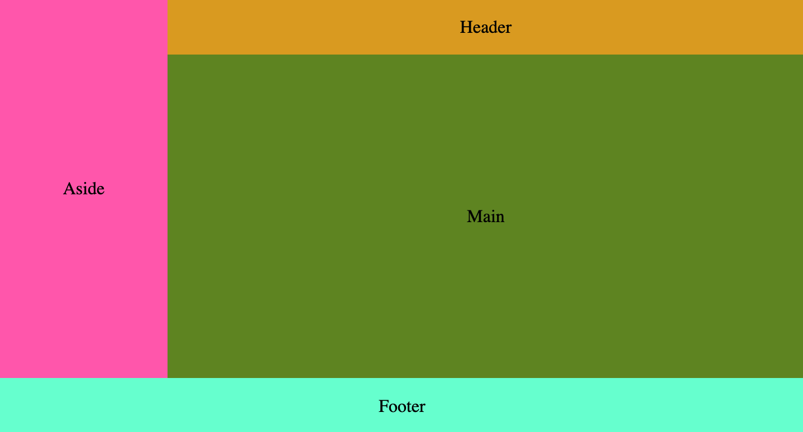

# CSS Task

Welcome in the CSS Grid task.

## For your information

This task is about how you can handle creating layouts using CSS Grid. This task is to create four sections and position
them like in the screenshot below.

### Useful information about this project:

colors: `goldenrod, hotpink, olivedrab, aquamarine`

sizes: `100px`

aside-width: `300px`

## Your task

You need to create styles in external `style.css` file (you can't touch HTML). Your result should look like this:

   
